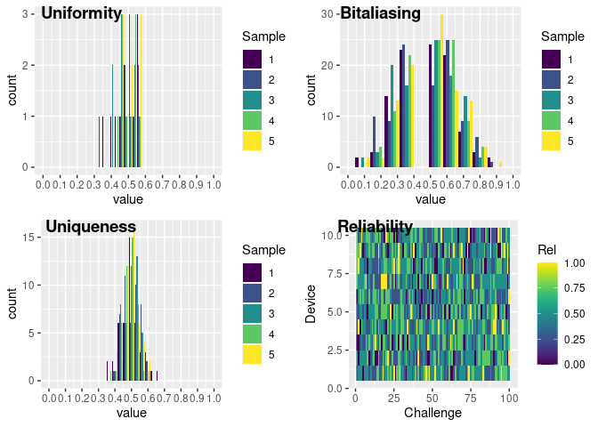

<!-- README.md is generated from README.Rmd. Please edit that file -->

# pufr <a href="https://servinagrero.github.io/pufr/"></a>

<!-- badges: start -->

[](https://lifecycle.r-lib.org/articles/stages.html#experimental)
[](https://app.codecov.io/gh/servinagrero/pufr?branch=main)
<!-- badges: end -->

## Overview

Physical Unclonable Functions, commonly knows as PUFs, are a mechanism
that leverages the manufacture variability of devices to generate
secrets. PUFs can be used to identify devices or to generate secrets.
This package provides functions and algorithms for their analysis and
evaluation. The functions provided in this package are optimised to be
fast enough for most use cases.

A Python implementation can be found in
[Github](https://github.com/servinagrero/pufrpy).

You can learn more about PUFs and their evaluation in
`vignette("pufr")`.

## Installation

You can install the development version of pufr from
[GitHub](https://github.com/servinagrero/pufr) with:

``` r
# install.packages("devtools")
devtools::install_github("servinagrero/pufr")
```

## Basic functionality

PUFR provides functions and operators to work both with bit vectors
(vectors containing 1s and 0s) and CRPs matrices (2D or 3D matrices with
1s and 0s).

``` r
library(pufr)

# rbits can be used to generate bits with desired probabilities
v1 <- rbits(50)
v2 <- rbits(50)

hamming_dist(v1, v2)
#> [1] 27
# Or alternatively
v1 %HD% v2
#> [1] 27

# Shannon entropy for bit vectors
entropy_bits(v1)
#> [1] 0.9895875
```

## Metrics

PUFR provides utilities to calculate the canonical metrics (uniformity,
bitaliasing, uniqueness and reliability) of CRPs. They can be calculated
using their respective functions.

``` r
# 5 devices with 10 challenges each
crps <- rbits(c(5, 10))

uniformity(crps)
#> [1] 0.5 0.7 0.7 0.9 0.5
bitaliasing(crps)
#>  [1] 1.0 0.6 0.2 0.4 0.6 0.6 0.8 0.8 1.0 0.6
uniqueness(crps)
#>  [1] 0.6 0.6 0.4 0.6 0.6 0.6 0.6 0.8 0.6 0.4

# For a 2D matrix, each column contains a sample
# In a 3D matrix, the 3rd dimension represents the samples
# 5 samples of 5 devices with 10 challenges each
crps <- rbits(c(5, 10, 5))
reliability(crps)
#>       [,1] [,2] [,3] [,4] [,5]
#>  [1,] 1.00 0.50 1.00 0.25 0.50
#>  [2,] 0.50 0.75 0.75 0.50 0.50
#>  [3,] 0.25 0.50 0.25 0.50 0.75
#>  [4,] 0.50 0.50 0.25 0.50 0.50
#>  [5,] 0.25 0.75 0.50 0.50 0.50
#>  [6,] 1.00 0.25 0.50 0.75 1.00
#>  [7,] 0.25 0.25 1.00 0.75 0.50
#>  [8,] 0.00 0.75 0.25 0.00 0.50
#>  [9,] 0.50 0.75 1.00 0.50 0.50
#> [10,] 0.00 0.25 0.50 0.50 0.75
```

All the metrics can be calculated at once by using the `metrics`
function, which handles both 2D and 3D matrices.

``` r
crps <- rbits(c(5, 10))
met <- metrics(crps)
```

### Exploration of metrics

Metrics created through the `metrics` function can be plotted and
summarised easily.

In the case of a 2D CRP matrix, 3 histograms are created, for
uniformity, bitaliasing and uniqueness respectively.

``` r
crps <- rbits(c(10, 100))
plot(metrics(crps))
```


In the case of a 3D CRP matrix, response samples are drawn from the 3rd
dimension. The histograms are now grouped per sample and an additional
raster plot is created to show the reliability of each independent
response.

``` r
crps <- rbits(c(10, 100, 5))
plot(metrics(crps))
```


